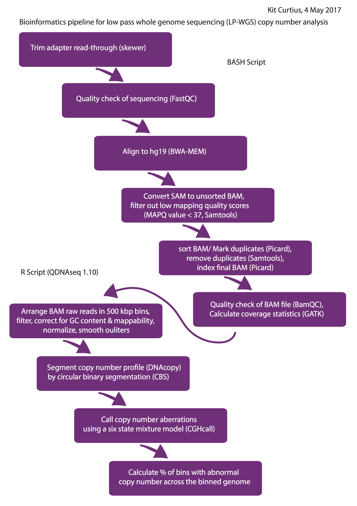

# The evolutionary history of human colitis-associated colorectal cancer

These are the scripts written and used to implement all bioinformatic and statistical analyses by the authors of manuscript:

"The evolutionary history of human colitis-associated colorectal cancer"

Authors: Ann-Marie Baker^\*, William Cross\*, Kit Curtius\*, Ibrahim Al-Bakir\*, Chang-Ho Ryan Choi\*, Hayley Davis, Daniel Temko, Sujata Biswas, Pierre Martinez, Marc Williams, James O Lindsay, Roger Feakins, Roser Vega, Stephen J Hayes, Ian PM Tomlinson, Stuart AC McDonald, Morgan Moorghen, Andrew Silver, James E East, Nicholas A Wright, Lai Mun Wang, Manuel Rodriguez-Justo, Marnix Jansen, Ailsa L Hart^, Simon J Leedham^ and Trevor A Graham^

\* joint first authors

^For correspondence:
- Ann-Marie Baker

Email: a.m.c.baker@qmul.ac.uk

- Simon Leedham

Email: simonl@well.ox.ac.uk

- Trevor Graham

Email: t.graham@qmul.ac.uk

*Data used in the analyses (except for publicly available TCGA datasets, indicated in script placeholders) can be accessed at European Genome-phenome Archive (EGA) DCA \*_____________\* *

## Folder contents:

### KC_Analyses

### Make_Bams_lpWGS_pipeline.sh
- Bash script that contains bioinformatics pipeline to create bam files from 81 low-pass whole genome sequenced tissue samples
- takes fastq file format and .txt with sample info as input (see workflow)

### QDNAseq_pipeline.R
- R script to take processed bam files
- Saves segmentation and CNA call data in a .Rdata file for downstream analyses (see workflow below)
  
### CACRC_evolution_CNV_analyses.R
-  R script performs the analyses to create:
						
	Figures 3B, 3C, 4 		
											
	Supplementary Tables 9, 10 		
									
  	All corresponding Results in the Main text regarding the above	

  
### WCHC_Analyses
   
   
### 2.0.makeBCFcallingScripts.R

- Makes a shell script for each sample in a list. Shell script is designed to run on a cluster.
- Runs BCFtools to call a latent list of potential SNVs
    
    
### 2.1.makeBCFindelScripts.R

- Same as above but for indels

### 2.2.0.makePlatypusScripts.R

- Makes a shell script to run Platypus jointly for a sample set (defined in the sample list)
- Each chromosome is run separately
- The source command is used to assess the BCFtools variant proposals 
- The mergeFinalVCF script concatenates the resulting vcfs to one

### 2.2.1.makePlatypusIndels.R

- Same as above but for indels

### 2.3.0.processVCF.platypus.R

- Script runs locally
- Filters the Platypus derived variants by coverage (min 10X for each variant)
- Annotates variants using AnnoVar
- Outputs a .txt version of the vcf for germline and somatic variants separately

### 3.6.0.makeSequenzaScripts.R

- Script produces .seqz sequenza files from bams

### 3.6.1.analyseSequenza.R

- Script runs locally to analyse .seqz files as per manual

### 5.0.phylogeneticsPrep.R

- Takes a .txt vcf files and outputs a .nexux file for phylogenetic analyses of variants
- Nexus file can be run in PAUP, Phylip or other compatible software

### 5.1.HomoplasyParse.R

- Runs locally
- Reads in a multiple phylogeny, .tre file and outputs the most parsimonious tree along with statistics

### 5.3.phylogeneticsStats.R

- Runs locally
- Produces a table of tree shape statistics and homoplasy indexes
    
### CA_CRC_signatures

There are two scripts in the 'scripts' directory. 

###  1. quasi_bulk_signatures

This script is in three parts: 

A) Code is provided to read in mutation data for CA-CRC and (TCGA) sporadic CRC tumours,
and classify mutations in each tumour among 96 mutation channels. For the CA-CRC data, 
since there are multiple sequenced regions for the same tumour, mutations are also 
assigned to individual tumour samples/regions in each sample.

B) Code is provided to assign mutational signature activities to each CA-CRC and sporadic 
CRC sample using non-negative least squares regression, implemented in the R package 
'nnls'. This section also contains code for visualising the mutational signature 
assignments in CA-CRC samples.

C) Code is provided to assess the differences in inferred mutational signature composition 
between CA-CRC and sporadic CRC samples.

### 2. time_evolution

This script is in three parts:

A) Code is provided to read in mutation data for CA-CRC tumours and classify mutations in 
each tumour among 96 mutation channels. Since there are multiple sequenced regions for 
the same tumour, mutations are also assigned to individual tumour samples/regions in each 
sample. Based on the regional mutation assignments mutations are also classified in terms
of timing as 'pre', 'early', or 'late'

B) Code is provided to assign mutational signatures to the mutations in each timing class
for each tumour

C) Code is provided to test and visualise differences in each mutational signature between 
timing classes across samples. 
    
